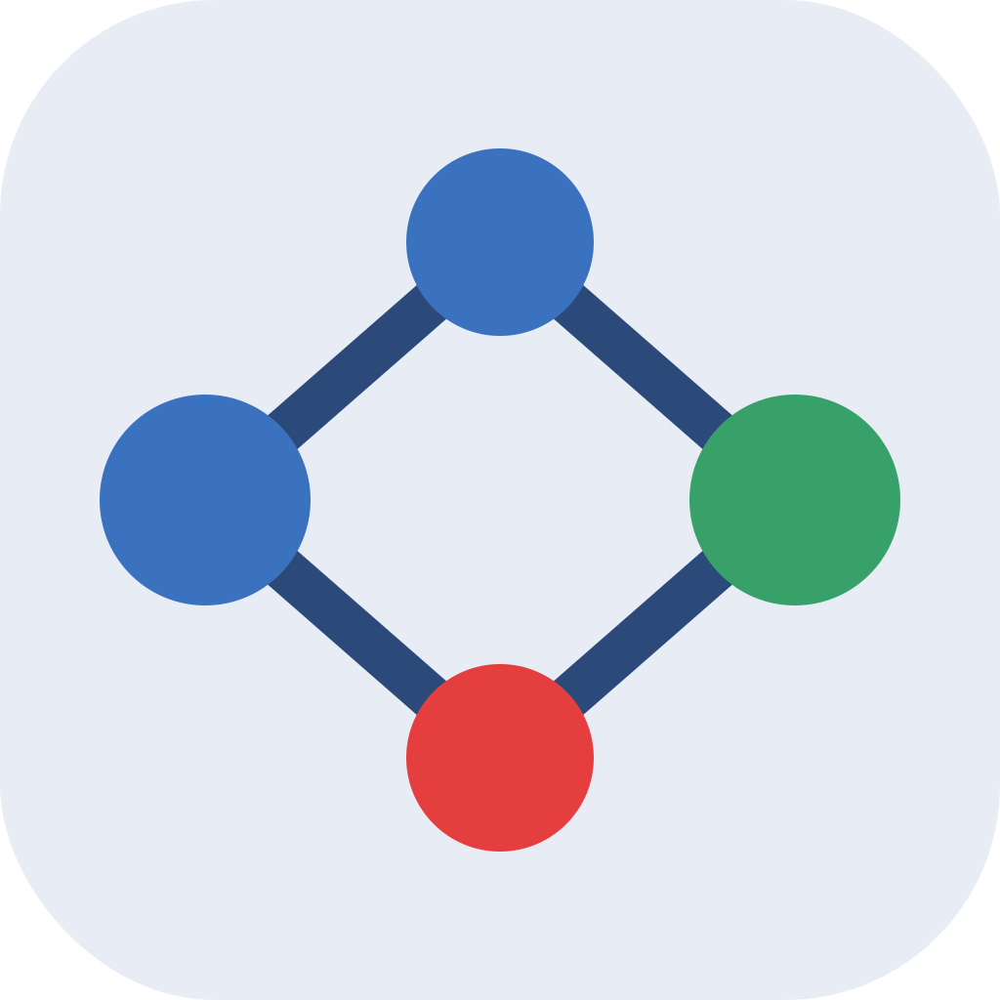

<p align="center">
  
</p>

<h1 align="center">Dagsy — Local Airflow DAG Watcher</h1>

<p align="center">
  <strong>macOS compatible</strong>
</p>

<p align="center">
  Your local Airflow co-pilot — alerts you the moment something fails or finishes, so you can actually get other things done.
</p>

---

## Why Dagsy?

You triggered the DAG. It's running. Now what — do you just... sit there and watch it? 🙃

Local DAGs can take minutes or hours. You triggered it — now you're stuck waiting, not knowing when it's done or if something broke. **Dagsy fixes that.**

Trigger your DAG, then go do literally anything else. Write code, answer Slack, grab a coffee ☕. The moment something fails, retries, or finishes — a native macOS popup taps you on the shoulder. No missed failures. No "wait, when did that break?"

It's especially great for long backfills and multi-task pipelines where you need to stay in the loop without being glued to a browser tab.

- **Instant popup dialogs** — macOS alerts you the second something needs attention
- **Never miss a failure** — no more manually refreshing the Airflow UI
- **Retries vs. failures** — know the difference before you start panicking
- **Walk away while your DAG runs** — come back only when it matters
- **Zero context-switching tax** — stay in flow, let Dagsy do the watching

---

## Install

```bash
./install.sh
```

Then launch:

```bash
open ~/Applications/Dagsy.app
```

> **First launch blocked by macOS?**
> Go to **System Settings → Privacy & Security** → scroll down → click **Open Anyway**.

---

## Screenshots

| Main Panel | Failure Panel | Success Panel |
|:---:|:---:|:---:|
|  |  |  |

---

## Features

| Feature | Details |
|---|---|
| Task failure alerts | Native dialog with task name, DAG, run ID, attempt number, and a direct "Open in Airflow" button pointing at the error log |
| Task retry alerts | Notifies on each retry attempt so you can monitor progress |
| DAG-level failure alerts | Triggered when the whole DAG run fails (deduplicated against task-level alerts) |
| Manual run success alerts | Notifies when a manually triggered DAG run completes successfully |
| Failure panel | Persistent panel listing all recent failures with one-click links |
| Success panel | Persistent panel listing recent successful manual runs |
| Dialog queue | Alerts are queued and shown one-by-one — none are ever lost |
| State persistence | Watcher state survives restarts — no duplicate alerts after a reboot |
| Configurable | Poll interval, Airflow URL, credentials, and DAG filter are all CLI flags |

---

## Requirements

- macOS 10.15 or later
- Python 3 (ships with macOS — no install needed)
- A locally running Airflow instance (e.g. via [Astronomer CLI](https://www.astronomer.io/docs/astro/cli/overview))

---

## Project Structure

```
Dagsy/
├── watch_local_airflow_failures.py   # Core watcher script (pure Python, no deps)
├── install.sh                        # One-command installer
├── bin/
│   ├── airflow-dag-listener-controller  # App controller binary (macOS arm64/x86_64)
│   ├── airflow-dialog-helper            # Dialog helper binary
│   ├── airflow-failure-alert            # Failure panel UI binary
│   └── airflow-success-panel            # Success panel UI binary
├── app/
│   └── Info.plist                    # macOS bundle metadata
├── assets/
│   ├── icon.svg                      # App icon source
│   ├── icon.png                      # App icon (1024×1024 PNG)
│   └── applet.icns                   # App icon (macOS ICNS bundle)
├── scripts/
│   └── build_app.sh                  # Packages everything into Dagsy.app
└── README.md
```

---

## Building the .app manually

If you want to build the `.app` yourself instead of using `install.sh`:

```bash
git clone https://github.com/liorbar777/Dagsy.git
cd Dagsy
chmod +x scripts/build_app.sh
./scripts/build_app.sh
```

By default the `.app` is written to `~/Applications/Dagsy.app`. Override with `--dest`:

```bash
./scripts/build_app.sh --dest ~/Desktop/Dagsy.app
```

### Build error: “SDK is not supported by the compiler” / “failed to build module ‘AppKit’”

That means the **Swift compiler** and the **macOS SDK** on the machine came from different updates (for example Command Line Tools updated while Xcode was not, or an IDE runs a different `swiftc` than the SDK). The Swift versions only differ by a tiny build number (e.g. `swiftlang-6.2.1.4.7` vs `…4.8`), but Apple’s compiler still refuses to import `AppKit`.

**Recommended:** build only with the project script (it pins one toolchain and clears a stray `SDKROOT`):

```bash
./scripts/build_app.sh
```

**If it still fails:**

1. Select a single developer directory — preferably full Xcode — so Swift and the SDK match:

   ```bash
   sudo xcode-select -s /Applications/Xcode.app/Contents/Developer
   ```

   (Adjust the path if your Xcode is named `Xcode-beta.app` or similar.)

2. Or reinstall Command Line Tools so Swift and the SDK upgrade together:

   ```bash
   sudo rm -rf /Library/Developer/CommandLineTools
   xcode-select --install
   ```

3. **PyCharm / other IDEs:** do not compile `src/airflow-dialog-helper.swift` with the IDE’s Swift tool. Use the script above, or run the same `swiftc` as `xcode-select` points to (e.g. `$(xcode-select -p)/usr/bin/swiftc`).

---

## Running without the .app

You can run the watcher directly from the terminal without building the app:

```bash
python3 watch_local_airflow_failures.py \
  --base-url http://localhost:8080 \
  --username *** \
  --password *** \
  --poll-interval 5
```

> **Note:** Replace `***` with your Airflow username and password. The default credentials for a local Airflow instance are typically `admin` / `admin`.

### CLI options

| Flag | Default | Description |
|---|---|---|
| `--base-url` | `http://localhost:8080` | Airflow base URL |
| `--username` | `***` | Airflow username (default: `admin`) |
| `--password` | `***` | Airflow password (default: `admin`) |
| `--poll-interval` | `5` | Seconds between polls |
| `--limit` | `20` | Max recent DAG runs to inspect per DAG |
| `--dag-id` | _(all DAGs)_ | Filter to specific DAG IDs (repeat for multiple) |
| `--popup-mode` | `dialog` | `dialog` for native panels, `notification` for macOS notifications |
| `--environment-label` | `local` | Label shown in alert panels |

Example — watch two specific DAGs with macOS notifications:

```bash
python3 watch_local_airflow_failures.py \
  --dag-id my_etl_dag \
  --dag-id another_dag \
  --popup-mode notification
```

---

## State & Logs

Dagsy stores runtime state in:

```
~/Library/Application Support/local-airflow-watcher/
├── watcher_state.json         # Seen failures/successes (survives restarts)
├── failure_panel_state.json
├── success_panel_state.json
├── failure_panel_runtime.json
├── success_panel_runtime.json
└── dialog_queue/              # Queued alerts waiting to be shown
```

To fully reset state (re-seeds from current Airflow state on next launch):

```bash
rm -rf ~/Library/Application\ Support/local-airflow-watcher/
```

---

## How It Works

1. On first run Dagsy **seeds** its state by scanning recent DAG runs — preventing a flood of alerts for pre-existing failures.
2. Every `--poll-interval` seconds it queries the Airflow REST API v2 globally across **all DAGs** (running, queued, failed, and recent successes), so no manual run is ever missed regardless of how quickly it completes.
3. New task failures/retries trigger a **failure panel** entry and a native dialog.
4. Successful manual runs trigger a **success panel** entry — multiple DAGs tracked independently.
5. Dialogs are serialised through a queue so they appear one-by-one and are never dropped.

---

## Author

Created by **Lior Bar** — Premium DE

## Credits

Developed with the assistance of [OpenAI Codex](https://openai.com/codex) and [Claude Code](https://claude.ai/code) (Anthropic).

## License

MIT
